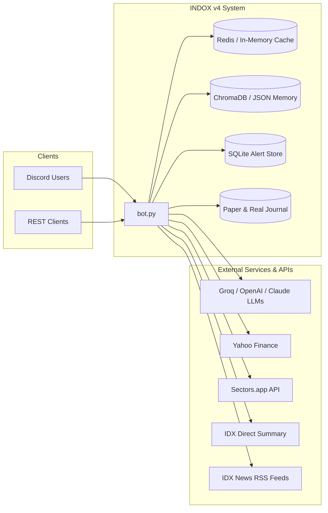

# INDOX — IDX Analyst Bot v4

An AI and quantitative research assistant for the **Indonesian Stock Exchange (IDX)**. The system combines a Discord bot interface, a REST API, multi-provider LLM orchestration (Groq, OpenAI, Anthropic Claude, Ollama), quantitative risk tooling, backtesting engines, and a paper trading execution tracker into a single asyncio process.

---

## Table of Contents

1. [System Design](#system-design)
2. [Features](#features)
3. [Module Layout](#module-layout)
4. [Configuration](#configuration)
5. [Quick Start](#quick-start)
6. [Discord Commands](#discord-commands)
7. [REST API](#rest-api)
8. [Feature Flags & Optional Dependencies](#feature-flags--optional-dependencies)
9. [Deployment](#deployment)
10. [Disclaimer](#disclaimer)

---

## System Design

### Design Goals

| Goal | How it is achieved |
| :--- | :--- |
| **Single deployable unit** | Discord bot, FastAPI server, background schedulers, alert monitors, and sentiment pipelines run in one process (`bot.py`) via `asyncio`. |
| **Multi-provider AI** | Automatic failover across Groq Cloud, OpenAI-compatible endpoints, Anthropic Claude, OpenRouter, and local Ollama instances (`utils/llm_provider.py`). |
| **Layered separation** | Presentation (cogs/API) → orchestration (fetcher, AI engine) → domain (risk, backtest, sentiment, execution) → data (yfinance, Sectors.app, IDX API, RSS). |
| **Graceful degradation** | Redis, ChromaDB, cvxpy, and scipy are optional; each module falls back cleanly to in-memory or heuristic alternatives. |
| **Feature toggles** | `FEAT_*` env flags disable entire subsystems without code changes. |
| **IDX-specific logic** | Sector-aware scoring, coal benchmark context, Indonesian news sources, and real IDX lot sizing are first-class primitives. |

### Runtime Model

`bot.py` is the sole entry point. On startup it:

1. Validates required secrets (`DISCORD_TOKEN`, AI provider configuration, and `API_SECRET` in production).
2. Initializes shared infrastructure (cache layer, optional vector memory).
3. Spawns concurrent asyncio tasks:
   - **FastAPI** (uvicorn) on `API_HOST:API_PORT`
   - **Sentiment pipeline** refresh loop (every 15 minutes)
   - **Price alert checker** loop (every 60 seconds)
   - **Groq/AI health check** scheduler
4. Loads Discord cogs and connects to the Gateway with slash command synchronization.

```text
┌─────────────────────────────────────────────────────────────────────────────┐
│                              bot.py (asyncio)                               │
├──────────────┬──────────────┬──────────────┬──────────────┬─────────────────┤
│ Discord Bot  │  FastAPI     │  Sentiment   │ Price Alert  │  AI Health      │
│ (cogs)       │  (uvicorn)   │  Pipeline    │  Monitor     │  Scheduler      │
└──────┬───────┴──────┬───────┴──────┬───────┴──────┬───────┴────────┬────────┘
       │              │              │              │                │
       ▼              ▼              ▼              ▼                ▼
   cogs/*         api/app.py    sentiment/     data/alert_store   utils/groq_health
   core/*         risk/*        pipeline.py    utils/stock_service
   execution/*    backtest/*
   risk/*
   backtest/*
       │              │              │              │
       └──────────────┴──────────────┴──────────────┴──► core/cache (Redis / In-Memory)
                                                         memory/* (JSON / ChromaDB)
                                                         execution/paper (JSON)
                                                         data/alerts.db (SQLite)
```

### External Dependencies & Architecture



---

### Request Flow — Daily Picks

The picks subsystem combines quantitative screening with AI narration:

1. **Regime guard** — `utils/market_regime.py` checks IHSG trend (MA50/MA200) and coal benchmark context.
2. **Universe scan** — `utils/scan_utils.py` filters liquid IDX tickers by market cap, volume ratio, and ADX.
3. **Quant shortlist** — `utils/picks_engine.py` scores candidates using weighted fundamental / technical / flow / sentiment rules (`SCORE_WEIGHTS` in config).
4. **AI narration** — `core/ai_engine.generate_daily_picks_v4` produces human-readable trade rationale with entry/exit plans.
5. **Tracking & Performance** — `data/picks_tracker.py` records picks to monitor 30-day hit-rate statistics (`!pickstats`).

### Caching Strategy

| Layer | Store | TTL | Keys |
| :--- | :--- | :--- | :--- |
| Distributed | Redis (optional) | 60s–3600s | `ticker:*`, `scan:idx`, `sent:*`, `fundamental:*` |
| Process-local | `utils/runtime_cache` | 45s–180s | Stock data hot path, VaR, correlation series |
| Persistent | SQLite (`data/alerts.db`) | — | Active price alerts, picks cache date |
| File Store | JSON (`memory/`, `execution/paper/`) | — | User chat memory, paper trading states, broker trade journal |

Redis connection failures automatically fall back to an in-process dict with TTL expiry — the bot continues operating without interruption.

### Security Model

- **Discord**: Token-based bot auth; channel allowlist for free-form AI chat (`CHAT_CHANNEL_ALLOWLIST`).
- **REST API**: All `/api/v4/*` routes require `X-API-Key` matching `API_SECRET`. Production startup rejects empty or default `changeme` secrets.
- **CORS**: Configurable via `API_CORS_ORIGINS`; restricted by default in production.
- **Observability**: Prometheus counters/histograms on `/metrics`; structured JSON logging.

---

## Features

### 1. AI Research Assistant & LLM Orchestration

- **Multi-Provider Failover**: Supports Groq Cloud (`openai/gpt-oss-120b`, `llama-3.1-8b-instant`), OpenAI / OpenRouter, Anthropic Claude, and local Ollama via `AI_PROVIDERS`.
- **4-Layer CIO Prompt**: Macro regime → Fundamental quality → Technical confluence → Sentiment & foreign flow.
- **Sector-Specific Rules**: Dynamic thresholding for Banking (NPL/NIM), Coal & Mining (commodity cycle), Property, and Consumer tickers.
- **Multi-Entry Framework**: Detects Momentum, Pullback, and Breakout setups with exact entry zones, Stop Loss, Target Profits (TP1, TP2), Risk/Reward ratio, and suggested lot sizing.
- **RAG & Chat Memory**: Per-user conversation memory with optional ChromaDB vector storage for historical retrieval.

### 2. Paper Trading & Execution Journal

- **Virtual Trade Tracker**: Record and manage simulated swing positions (`!paper enter`, `!paper size`, `!paper close`, `!paper cancel`).
- **Automated Price Check**: `!paper check` / `/paper check` evaluates open trades against live IDX market prices to check if SL, TP1, or TP2 have been hit.
- **Real Trade Journaling**: Log executed broker trades (`!catat TICKER BUY/SELL PRICE LOT`) with persistent history in JSON.
- **Performance Analytics**: Generates win rate, realized PnL, profit factor, and average return statistics (`!paper stats`).

### 3. Quantitative Risk Engine

- **Value-at-Risk (VaR / CVaR)**: Historical and parametric 1-day Value-at-Risk & Expected Shortfall at 95% and 99% confidence.
- **Crisis Stress Testing**: 5 historical shock scenarios (COVID-19 crash, Fed rate hikes, Evergrande default, IDX circuit breaker, custom -30%) with sector-specific beta impacts.
- **Correlation Matrix**: Pairwise correlation matrix with concentration alerts (>0.85) and diversification scoring.
- **Portfolio Optimization**: Black-Litterman (incorporating analyst views), Mean-Variance, and CVaR minimization.
- **Kelly Sizing**: Fractional Kelly criterion position sizing calculator.

### 4. Backtesting & Robustness Suite

- **ATR Swing Simulation**: Backtests multi-entry strategies with dynamic ATR trailing stops, regime filters, and adaptive position sizing.
- **Walk-Forward Analysis (WFA)**: Rolling in-sample / out-of-sample window validation with automated robustness scoring.
- **Monte Carlo Engine**: Runs up to 50,000 block-bootstrap simulations to project return distributions, maximum drawdown, and probability of profit.

### 5. Market Intelligence & Alerts

- **Daily Top Picks**: Automated scheduled posting to `DAILY_CHANNEL_ID` with quantified shortlists and AI trade plans.
- **Market Overview**: Real-time IHSG index status, MA regime phase, top gainers, and top losers.
- **Portfolio Health Check**: Upload portfolio holdings (CSV or plain text) for concentration analysis, risk exposure, and AI review.
- **Price Alerts**: SQLite-backed alerts with automated background evaluation and private Discord DM notifications.

### 6. Sentiment Pipeline

- **Indonesian Financial News**: Aggregates RSS feeds from CNBC Indonesia, Bisnis.com, and Kontan.
- **Event Detection**: Automated keyword tagging for share buybacks, dividend announcements, earnings beats, and regulatory actions.
- **Background Refresh**: Periodic 15-minute background aggregation cached to Redis.

---

## Module Layout

```text
INDOX/
├── bot.py                        # Entry point — Discord bot + FastAPI + background workers
├── config.py                     # Environment variables, feature flags, trading constants
├── requirements.txt              # Python package dependencies
├── Dockerfile                    # Multi-stage production container image
├── docker-compose.yml            # Docker stack (Bot + Redis)
├── railway.json / nixpacks.toml  # Cloud deployment manifests
│
├── api/
│   └── app.py                    # FastAPI routes, API auth, Prometheus metrics
│
├── cogs/                         # Discord command modules (discord.py Cogs)
│   ├── analisis_cog.py           # AI research & ticker deep dive
│   ├── alert_cog.py              # Real-time price alerts & DM notifications
│   ├── backtest_cog.py           # Backtesting, Walk-Forward, Monte Carlo
│   ├── chat_cog.py               # AI conversational assistant (@mention)
│   ├── help_cog.py               # Interactive command guide (!bantuan)
│   ├── market_cog.py             # IHSG overview, movers & monthly report
│   ├── paper_cog.py              # Paper trading execution & broker trade journal
│   ├── picks_cog.py              # Daily screening & pick hit-rate stats
│   ├── portfolio_cog.py          # Portfolio CSV holding analysis
│   ├── risk_cog.py               # VaR, CVaR, Stress test, Correlation, Kelly, Optimizer
│   └── legacy_backtest_cog.py    # Deprecation notice for legacy v3 engine
│
├── core/
│   ├── ai_engine.py              # Groq & LLM prompt engineering, CIO analysis
│   └── cache.py                  # Redis & in-memory caching abstraction
│
├── execution/                    # Trade execution & journaling
│   ├── paper_trader.py           # Paper trade state engine (SL/TP triggers, PnL)
│   ├── journal.py                # Real broker trade journaler
│   └── paper/                    # Persistent storage for paper & real trade JSON
│
├── data/
│   ├── fetcher.py                # Async data facade
│   ├── alert_store_sqlite.py     # SQLite persistence for alerts and pick dates
│   ├── picks_tracker.py          # Historical pick performance tracking
│   └── alerts.db                 # SQLite database file
│
├── memory/
│   ├── simple_memory.py          # Per-user JSON conversational memory
│   └── vector_memory.py          # ChromaDB vector store for RAG (optional)
│
├── risk/
│   ├── engine.py                 # VaR, CVaR, stress testing, correlation matrices
│   └── optimizer.py              # Black-Litterman, CVaR, Mean-Variance, Kelly sizing
│
├── backtest/
│   └── engine_backtest.py        # ATR simulation, Walk-Forward, Monte Carlo engine
│
├── sentiment/
│   └── pipeline.py               # RSS feeds scraper, NLP scoring, event flags
│
├── utils/                        # Shared utilities & services
│   ├── stock_service.py          # Yahoo Finance + Sectors.app integration
│   ├── idx_api.py                # Direct IDX price & summary fetcher
│   ├── llm_provider.py           # Multi-provider LLM adapter (Groq, OpenAI, Claude, Ollama)
│   ├── picks_engine.py           # Multi-factor quant scoring shortlist
│   ├── scoring_rules.py          # Fundamental & technical composite scoring
│   ├── scan_utils.py             # Liquid universe screener
│   ├── market_regime.py          # IHSG trend, MA50/MA200, coal benchmark
│   ├── position_sizer.py         # Risk-adjusted lot sizing calculator
│   ├── groq_health.py            # AI provider uptime monitoring
│   ├── yf_guard.py               # Rate-limited yfinance accessor
│   ├── logger.py                 # Structured JSON logging
│   └── ticker_utils.py           # IDX ticker normalization (.JK handler)
│
└── tests/                        # Test suite
```

---

## Configuration

Create a `.env` file from the provided template:

```bash
cp env.example .env
```

### Environment Variables

| Variable | Required | Default | Description |
| :--- | :--- | :--- | :--- |
| `DISCORD_TOKEN` | **Yes** | — | Discord Bot Token from Developer Portal |
| `DAILY_CHANNEL_ID` | **Yes** | `0` | Channel ID for automated daily top picks |
| `ALERT_CHANNEL_ID` | No | `DAILY_CHANNEL_ID` | Channel ID for system announcements |
| `GROQ_API_KEY` | No* | — | Groq Cloud API Key (*required if `AI_PROVIDERS` is not set) |
| `GROQ_MODEL` | No | `openai/gpt-oss-120b` | Default Groq model |
| `GROQ_MODEL_FAST` | No | `llama-3.1-8b-instant`| Fast model for sentiment & quick tasks |
| `AI_PROVIDERS` | No | — | JSON array of providers with automatic failover (Groq, OpenAI, Claude, Ollama) |
| `SECTORS_API_KEY` | No | — | Sectors.app API key for enriched IDX fundamental data |
| `API_SECRET` | Prod | — | Secret token required for REST API (`X-API-Key` header) |
| `PORT` | No | `8080` | Port for FastAPI REST server |
| `API_HOST` | No | `0.0.0.0` | Bind host for FastAPI |
| `API_CORS_ORIGINS` | No | localhost dev | Comma-separated list of allowed CORS origins |
| `REDIS_URL` | No | `redis://localhost:6379/0` | Redis connection URL; leave blank for in-memory cache |
| `FEAT_RAG` | No | `false` | Enable ChromaDB vector memory for RAG context |
| `FEAT_RISK` | No | `true` | Enable quantitative risk engine |
| `FEAT_OPT` | No | `true` | Enable portfolio optimizer |
| `FEAT_SENT` | No | `true` | Enable sentiment RSS analysis pipeline |
| `ALERT_CHECK_SECONDS` | No | `60` | Interval in seconds for checking price alerts |
| `CHAT_CHANNEL_ALLOWLIST`| No| — | Comma-separated channel IDs allowed for AI chat |
| `ENV` | No | `production` | Environment mode (`development` or `production`) |
| `LOG_LEVEL` | No | `INFO` | Logging level (`DEBUG`, `INFO`, `WARNING`, `ERROR`) |
| `LOG_FORMAT` | No | `json` | Logging format (`json` or `text`) |

---

## Quick Start

### 1. Prerequisites

- Python 3.11 or 3.12
- Redis (optional, in-memory cache used by default)
- Discord Bot Token with **Message Content Intent** enabled

### 2. Local Setup

```bash
# Clone repository
git clone <repository_url>
cd INDOX

# Create virtual environment
python3 -m venv .venv
source .venv/bin/activate

# Install dependencies
pip install -r requirements.txt

# Configure environment
cp env.example .env
# Edit .env with your DISCORD_TOKEN, GROQ_API_KEY, and API_SECRET

# Run bot
python bot.py
```

---

## Discord Commands

INDOX supports both prefix commands (`!`) and Discord Slash Commands (`/`).

### 📊 AI Research & Chat

| Command | Slash Command | Description |
| :--- | :--- | :--- |
| `!analisis <TICKER> [tanya]` | `/analisis ticker:[TICKER]` | Comprehensive AI research report (Fundamental, Technical, Flow, Plan) |
| `@Bot [pertanyaan]` | — | Direct conversational Q&A with conversational context memory |
| `!reset` | — | Reset your user conversation memory with the bot |

### 📈 Market & Screening

| Command | Slash Command | Description |
| :--- | :--- | :--- |
| `!picks [force]` | `/picks [force]` | Daily top 3 swing prospects screened across the liquid IDX universe |
| `!pickstats` | — | Historical 30-day performance and hit-rate of daily picks |
| `!market` | `/market` | Real-time IHSG index status, market regime, top gainers & losers |
| `!portfolio` | — | Analyze portfolio risk & diversification (attach CSV or text list) |
| `!alert <TICKER> <op> <price>` | — | Subscribe to real-time price alerts (e.g. `!alert BBCA > 10500`) |
| `!alert list` | — | View all your active price alerts |
| `!alert hapus <TICKER>` | — | Delete active price alert for a ticker |
| `!watchlist` / `!wl` | — | View default stock watchlist |

### 📝 Paper Trading & Execution

| Command | Slash Command | Description |
| :--- | :--- | :--- |
| `!paper enter <TICKER> <ENTRY> <SL> <TP1> <TP2> [LOT]` | `/paper action:enter` | Open a new virtual paper trade |
| `!paper list` | `/paper action:list` | View all currently open paper positions |
| `!paper check` | `/paper action:check` | Check open positions against live market prices for SL/TP triggers |
| `!paper close <ID> <HARGA>` | `/paper action:close` | Manually close an open paper position |
| `!paper size <ID> <LOT>` | — | Update position lot size for an existing trade |
| `!paper cancel <ID>` | `/paper action:cancel` | Cancel and delete an open paper trade |
| `!paper stats` | `/paper action:stats` | View full paper trading performance report (PnL, Win Rate, PF) |
| `!catat <TICKER> <BUY\|SELL> <PRICE> <LOT> [NOTE]` | `/catat` | Record real broker executions in trade journal |

### 🛡️ Quantitative Risk & Optimizer

| Command | Slash Command | Description |
| :--- | :--- | :--- |
| `!var <TICKER> [method]` | `/var ticker:[TICKER]` | Compute 1-day 95% & 99% VaR, CVaR, and annual volatility |
| `!stress <TICKER1> <TICKER2>...`| `/stress tickers:[LIST]` | Stress test equal-weight portfolio against 5 historical crisis scenarios |
| `!corr <TICKER1> <TICKER2>...` | `/corr tickers:[LIST]` | Pairwise correlation matrix & diversification score |
| `!optimize <method> <TICKER...>` | `/optimize method:[M]` | Optimize portfolio weights (`black_litterman`, `cvar`, `mean_variance`)|
| `!kelly <win%> <avg_win%> <avg_loss%>` | `/kelly` | Calculate optimal position sizing via Fractional Kelly Criterion |

### 🔬 Backtesting Suite

| Command | Slash Command | Description |
| :--- | :--- | :--- |
| `!backtest <TICKER> [bulan]` | `/backtest ticker:[TICKER]` | Run ATR swing backtest with adaptive risk & Monte Carlo summary |
| `!walkforward <TICKER> [tahun]` | `/walkforward ticker:[TICKER]`| Walk-Forward out-of-sample robustness validation (1–5 years) |
| `!montecarlo <TICKER> [bulan]` | `/montecarlo ticker:[TICKER]`| 50,000 bootstrap Monte Carlo distribution simulation |
| `!bantuan` / `!h` | — | Display interactive bot help and command reference embed |

---

## REST API

When the bot runs, it starts a FastAPI server on `API_PORT` (default: `8080`).

### Authentication

Protected endpoints require the `X-API-Key` header matching your configured `API_SECRET`.

```bash
X-API-Key: your_api_secret_here
```

### Endpoints Overview

| Method | Endpoint | Auth | Purpose |
| :--- | :--- | :--- | :--- |
| `GET` | `/health` | No | Basic liveness check |
| `GET` | `/ready` | No | Readiness check (Redis, Groq/LLM status) |
| `GET` | `/metrics` | No | Prometheus metrics output |
| `POST`| `/api/v4/analyze` | Yes | Execute full AI ticker analysis pipeline |
| `POST`| `/api/v4/optimize` | Yes | Portfolio optimization & rebalancing suggestions |
| `GET` | `/api/v4/backtest/{ticker}` | Yes | Backtest simulation or Walk-Forward analysis |

### API Examples

#### 1. Analyze Ticker

```bash
curl -X POST http://localhost:8080/api/v4/analyze \
  -H "Content-Type: application/json" \
  -H "X-API-Key: your_api_secret" \
  -d '{
    "ticker": "BBCA",
    "user_question": "Apakah cocok entry saat pullback ke support?",
    "include_sentiment": true,
    "include_var": true
  }'
```

#### 2. Portfolio Optimization

```bash
curl -X POST http://localhost:8080/api/v4/optimize \
  -H "Content-Type: application/json" \
  -H "X-API-Key: your_api_secret" \
  -d '{
    "tickers": ["BBCA", "BBRI", "TLKM", "ASII"],
    "method": "black_litterman",
    "analyst_views": {
      "BBCA": 0.12,
      "BBRI": 0.15
    }
  }'
```

#### 3. Backtest or Walk-Forward

```bash
# Standard Backtest (12 months)
curl -X GET "http://localhost:8080/api/v4/backtest/BBCA?months=12" \
  -H "X-API-Key: your_api_secret"

# Walk-Forward Robustness Test
curl -X GET "http://localhost:8080/api/v4/backtest/BBCA?months=24&walk_forward=true" \
  -H "X-API-Key: your_api_secret"
```

OpenAPI interactive docs are available at `http://localhost:8080/docs` when `ENV != production`.

---

## Feature Flags & Optional Dependencies

| Component | Flag / Setting | Required Package | Fallback Behavior |
| :--- | :--- | :--- | :--- |
| **Vector RAG Memory** | `FEAT_RAG=true` | `chromadb`, `sentence-transformers` | Falls back to in-memory / JSON history |
| **CVaR Optimizer** | `FEAT_OPT=true` | `cvxpy` (optional) | Falls back to scipy SLSQP optimizer |
| **Parametric VaR & BL**| `FEAT_RISK=true` | `scipy` (in requirements) | Falls back to historical quantile calculation |
| **Distributed Cache** | `REDIS_URL` set | `redis` (in requirements) | Falls back to process-local TTL cache |
| **Cloudflare Bypass** | Automatic | `curl_cffi` (in requirements) | Falls back to standard requests / yfinance |

---

## Deployment

### Docker Compose (Recommended)

Run the bot alongside a healthy Redis service with persistent volumes:

```bash
# 1. Ensure .env is populated with valid tokens
cp env.example .env

# 2. Build and start containers
docker-compose up -d --build

# 3. View logs
docker-compose logs -f bot
```

### Railway & Nixpacks

1. Connect your Git repository to **Railway**.
2. Railway will automatically detect `railway.json` and `nixpacks.toml` using Python 3.12.
3. Configure required Environment Variables in the Railway Dashboard (`DISCORD_TOKEN`, `GROQ_API_KEY`, `API_SECRET`, etc.).
4. Deploy service.

---

## Disclaimer

All metrics, backtest simulations, Monte Carlo analyses, price alerts, and AI-generated outputs provided by INDOX are strictly for **educational and research purposes only**. Financial market data is sourced from third-party APIs (Yahoo Finance, Sectors.app, IDX RSS) and may be subject to delays or inaccuracies.

**Nothing in this repository or bot output constitutes financial, legal, or investment advice.** Always conduct your own research (DYOR) and consult a licensed financial advisor before making investment decisions.
