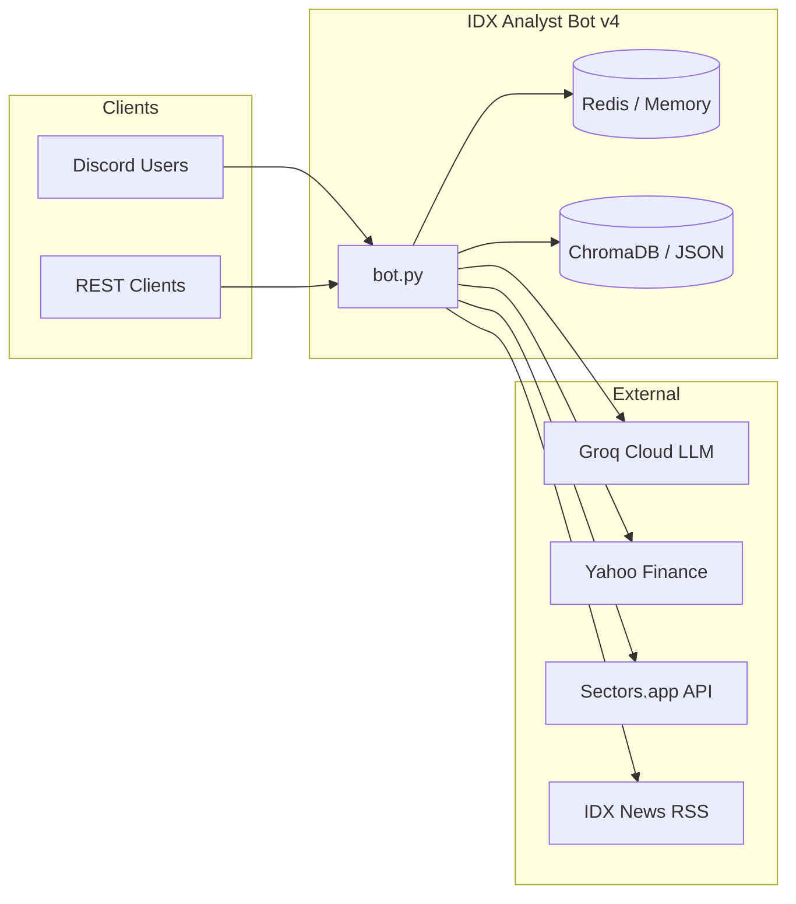

# IDX Analyst Bot v4

An AI and quantitative research assistant for the **Indonesian Stock Exchange (IDX)**. The system combines a Discord bot interface, a REST API, Groq-powered LLM analysis, portfolio risk tooling, and backtesting engines into a single asyncio process.

---

## Table of Contents

1. [System Design](#system-design)
2. [Features](#features)
3. [Module Layout](#module-layout)
4. [Configuration](#configuration)
5. [Quick Start](#quick-start)
6. [Discord Commands](#discord-commands)
7. [REST API](#rest-api)
8. [Feature Flags & Optional Dependencies](#feature-flags--optional-dependencies)
9. [Deployment](#deployment)
10. [Disclaimer](#disclaimer)

---

## System Design

### Design Goals

| Goal | How it is achieved |
| :--- | :--- |
| **Single deployable unit** | Discord bot, FastAPI server, background jobs, and schedulers run in one process (`bot.py`) via `asyncio`. |
| **Layered separation** | Presentation (cogs/API) → orchestration (fetcher, AI engine) → domain (risk, backtest, sentiment) → data (yfinance, Sectors.app, RSS). |
| **Graceful degradation** | Redis, ChromaDB, cvxpy, and scipy are optional; each module falls back to in-memory or heuristic alternatives. |
| **Feature toggles** | `FEAT_*` env flags disable entire subsystems without code changes. |
| **IDX-specific logic** | Sector-aware scoring, coal-price context, and Indonesian news sources are first-class, not bolted on. |

### Runtime Model

`bot.py` is the sole entry point. On startup it:

1. Validates required secrets (`DISCORD_TOKEN`, one AI provider, and `API_SECRET` in production).
2. Initializes shared infrastructure (cache, optional vector memory).
3. Spawns concurrent asyncio tasks:
   - **FastAPI** (uvicorn) on `API_HOST:API_PORT`
   - **Sentiment pipeline** refresh loop (every 15 minutes)
   - **Groq health check** scheduler
4. Loads Discord cogs and connects to the Gateway.

```text
┌─────────────────────────────────────────────────────────────────┐
│                        bot.py (asyncio)                         │
├──────────────┬──────────────┬──────────────┬────────────────────┤
│ Discord Bot  │  FastAPI     │  Sentiment   │  Groq Health       │
│ (cogs)       │  (uvicorn)   │  Background  │  Scheduler         │
└──────┬───────┴──────┬───────┴──────┬───────┴─────────┬──────────┘
       │              │              │                 │
       ▼              ▼              ▼                 ▼
   core/ai_engine  api/app.py   sentiment/       utils/groq_health
   data/fetcher    risk/*       pipeline.py
   risk/*          backtest/*
   backtest/*
       │              │              │
       └──────────────┴──────────────┴──► core/cache (Redis or in-memory)
                                          memory/* (JSON or ChromaDB)
```

### External Dependencies



---

### Request Flow — Daily Picks

The picks subsystem combines quantitative screening with AI narration:

1. **Regime guard** — `market_regime` checks IHSG trend and coal benchmark context.
2. **Universe scan** — `scan_utils` filters liquid IDX tickers by volume, ADX, foreign flow.
3. **Quant shortlist** — `picks_engine` scores candidates using weighted fundamental / technical / flow / sentiment rules (`SCORE_WEIGHTS` in config).
4. **AI narration** — `utils/ai_engine.generate_daily_picks` produces human-readable rationale.
5. **Tracking** — `data/picks_tracker` records picks for hit-rate stats (`!pickstats`).

### Caching Strategy

| Layer | Store | TTL | Keys |
| :--- | :--- | :--- | :--- |
| Distributed | Redis (optional) | 60s–1800s | `ticker:*`, `scan:idx`, `sent:*` |
| Process-local | `utils/runtime_cache` | 45s | Stock data hot path |
| Persistent | SQLite / JSON | — | Alerts, picks cache date, chat memory |

Redis connection failures automatically fall back to an in-process dict with TTL expiry — the bot keeps running without Redis.

### Security Model

- **Discord**: Token-based bot auth; channel allowlist for free-form chat (`CHAT_CHANNEL_ALLOWLIST`).
- **REST API**: All `/api/v4/*` routes require `X-API-Key` matching `API_SECRET`. Production startup rejects default `changeme` secrets.
- **CORS**: Configurable via `API_CORS_ORIGINS`; disabled by default in production.
- **Observability**: Prometheus counters/histograms on `/metrics`; structured JSON logging.

---

## Features

### AI Research Assistant

- **Model**: Groq Cloud `openai/gpt-oss-120b` (configurable via `GROQ_MODEL`, e.g. `qwen3.6-27b`) with a 4-layer CIO prompt (macro → fundamental → technical → sentiment/flow).
- **Sector-aware rules**: Banking, coal, mining, and property tickers use different quality thresholds in the system prompt.
- **Multi-entry framework**: Momentum, pullback, and breakout confluence with explicit entry zone, SL/TP, R/R, and position sizing output.
- **RAG memory** (optional): ChromaDB + sentence-transformers store past analyses and news for retrieval-augmented context.
- **Chat memory**: Per-user conversation history via `memory/simple_memory.py`; `@Bot` mentions and `!reset` supported.

### Quantitative Risk Engine

- **VaR / CVaR**: Historical and parametric 1-day Value at Risk at 95% confidence.
- **Stress testing**: Pre-built scenarios (COVID crash, Fed hikes, Evergrande, IDX circuit breaker, custom -30%) with sector-specific shock vectors.
- **Correlation matrix**: Pairwise correlation with alerts above `CORRELATION_ALERT_THRESHOLD` (0.85).
- **Portfolio optimizer**: Black-Litterman (with analyst views), mean-variance, and CVaR minimization (requires cvxpy).
- **Kelly sizing**: Fractional Kelly position sizing with configurable `KELLY_FRACTION`.

### Backtesting Suite

- **Swing strategy simulation**: ATR-based stop-loss/take-profit, regime filter, multi-entry confluence scoring.
- **Walk-forward analysis**: Rolling in-sample (4 mo) / out-of-sample (2 mo) windows with robustness score.
- **Monte Carlo**: 8,000 bootstrap block simulations for return distribution forecasting.
- **Metrics**: Win rate, profit factor, Sharpe, max drawdown, avg win/loss per period.

### Market Intelligence

- **Daily picks**: Scheduled UTC post to `DAILY_CHANNEL_ID` with quant shortlist + AI summary.
- **Liquid universe scan**: Filters by market cap, daily value, volume ratio, ADX, and composite score.
- **Market overview**: IHSG regime phase, top movers, coal price context.
- **Portfolio analysis**: CSV or plain-text holdings upload with P&L and concentration checks.
- **Price alerts**: SQLite-backed alert subscriptions with DM notifications on threshold breach.

### Sentiment Pipeline

- **Sources**: CNBC Indonesia, Bisnis.com, Kontan RSS feeds.
- **Scoring**: Keyword-based sentiment with optional Groq fast-model (`llama-3.1-8b-instant`) enrichment.
- **Event detection**: Buyback, dividend, earnings beat, regulatory risk flags per ticker.
- **Background refresh**: Runs every 15 minutes; results cached in Redis under `sent:{TICKER}`.

### REST API

| Endpoint | Auth | Purpose |
| :--- | :--- | :--- |
| `GET /health`, `GET /ready` | No | Liveness and dependency checks |
| `GET /metrics` | No | Prometheus metrics |
| `POST /api/v4/analyze` | Yes | Full AI analysis pipeline |
| `POST /api/v4/optimize` | Yes | Portfolio optimization |
| `GET /api/v4/backtest/{ticker}` | Yes | Backtest or walk-forward |

OpenAPI docs available at `/docs` when `ENV != production`.

---

## Module Layout

```text
INDOX/
├── bot.py                    # Entry point — Discord + FastAPI + background tasks
├── config.py                 # Environment, feature flags, trading constants
│
├── api/
│   └── app.py                # FastAPI routes, auth middleware, Prometheus
│
├── cogs/                     # Discord command modules (discord.py Cogs)
│   ├── analisis_cog.py       # AI ticker analysis
│   ├── backtest_cog.py       # Backtest, walk-forward, Monte Carlo
│   ├── risk_cog.py           # VaR, stress, correlation, optimize, Kelly
│   ├── picks_cog.py          # Daily picks scheduler + !picks
│   ├── market_cog.py         # IHSG overview and movers
│   ├── portfolio_cog.py      # Holdings analysis
│   ├── alert_cog.py          # Price alert subscriptions
│   ├── chat_cog.py           # @mention AI chat
│   └── help_cog.py           # Command reference
│
├── core/
│   ├── ai_engine.py          # Groq LLM orchestration and prompts
│   └── cache.py              # Redis / in-memory cache manager
│
├── data/
│   ├── fetcher.py            # Async data facade (cache → stock_service)
│   ├── alert_store_sqlite.py # Alert and picks-cache persistence
│   └── picks_tracker.py      # Pick performance tracking
│
├── memory/
│   ├── simple_memory.py      # Per-user JSON chat history
│   └── vector_memory.py      # ChromaDB RAG store (optional)
│
├── risk/
│   ├── engine.py             # VaR, CVaR, stress tests, correlation
│   └── optimizer.py          # Black-Litterman, CVaR, Kelly
│
├── backtest/
│   └── engine_backtest.py    # Strategy sim, walk-forward, Monte Carlo
│
├── sentiment/
│   └── pipeline.py           # RSS fetch, score, aggregate per ticker
│
├── utils/                    # Shared helpers
│   ├── stock_service.py      # yfinance + Sectors.app data assembly
│   ├── scoring_rules.py      # Composite pick scoring
│   ├── picks_engine.py       # Quant shortlist builder
│   ├── market_regime.py      # IHSG and coal context
│   ├── yf_guard.py           # Rate-limited yfinance wrapper
│   ├── groq_health.py        # LLM availability monitoring
│   └── logger.py             # Structured JSON logging
│
├── tests/                    # Unit and integration tests
├── Dockerfile
├── docker-compose.yml        # Bot + Redis stack
├── railway.json / nixpacks.toml
└── requirements.txt
```

### Import Boundaries

Core data paths (`data/fetcher`, `core/ai_engine`, cogs) depend on `utils/stock_service` — not on a legacy `utils/market_data` facade. Sector lookups flow through `utils/sector_data`. This keeps the data layer testable and avoids circular imports.

---

## Configuration

Copy `env.example` to `.env`:

| Variable | Required | Default | Description |
| :--- | :--- | :--- | :--- |
| `DISCORD_TOKEN` | **Yes** | — | Discord bot token |
| `GROQ_API_KEY` | No* | — | Legacy Groq Cloud API key; use `AI_PROVIDERS` for multiple providers |
| `AI_PROVIDERS` | No | — | Ordered JSON provider list with automatic failover (OpenAI-compatible or Anthropic) |
| `DAILY_CHANNEL_ID` | **Yes** | `0` | Channel for automated daily picks |
| `API_SECRET` | Prod | — | REST API key (`X-API-Key` header) |
| `SECTORS_API_KEY` | No | — | Sectors.app API for IDX fundamentals |
| `REDIS_URL` | No | `redis://localhost:6379/0` | Redis URL; empty → in-memory cache |
| `PORT` | No | `8080` | FastAPI listen port |
| `API_CORS_ORIGINS` | No | localhost dev | Comma-separated CORS origins |
| `FEAT_RAG` | No | `false` | Enable ChromaDB vector memory |
| `FEAT_RISK` | No | `true` | Enable risk engine |
| `FEAT_SENT` | No | `true` | Enable sentiment pipeline |
| `FEAT_OPT` | No | `true` | Enable portfolio optimizer |
| `ENV` | No | `production` | `development` or `production` |
| `LOG_LEVEL` | No | `INFO` | `DEBUG`, `INFO`, `WARNING`, `ERROR` |
| `LOG_FORMAT` | No | `json` | `json` or `text` |

---

## Quick Start

**Prerequisites:** Python 3.11 or 3.12, Redis optional.

```bash
git clone <repository_url>
cd INDOX
python -m venv .venv && source .venv/bin/activate
cp env.example .env   # fill in DISCORD_TOKEN, an AI provider, and API_SECRET
pip install -r requirements.txt
python bot.py
```

---

## Discord Commands

Prefix commands (`!`) and slash commands (`/`) are both supported.

### Risk & Portfolio

| Command | Description |
| :--- | :--- |
| `!var <TICKER> [historical\|parametric]` | 1-day VaR and CVaR at 95% |
| `!stress <TICKER1> <TICKER2> ...` | Portfolio stress test across historical scenarios |
| `!korrelasi / !corr <TICKER...>` | Correlation matrix |
| `!optimize <method> <TICKER...>` | `black_litterman` or `cvar` allocation |
| `!kelly <win%> <avg_win%> <avg_loss%>` | Kelly Criterion position size |

### Backtest

| Command | Description |
| :--- | :--- |
| `!backtest / !bt <TICKER> [months]` | ATR swing strategy simulation |
| `!walkforward / !wf <TICKER> [years]` | Walk-forward robustness test |
| `!montecarlo / !mc <TICKER> [months]` | Bootstrap Monte Carlo paths |

### Research & Market

| Command | Description |
| :--- | :--- |
| `!analisis / !a <TICKER> [question]` | Full AI research report |
| `!picks / !p` | Top swing prospects from liquid IDX universe |
| `!pickstats` | 30-day pick hit rate |
| `!market / !m` | IHSG overview and movers |
| `!portfolio / !pf` | Analyze holdings (CSV or plain text) |
| `!alert <TICKER> <op> <price>` | Price alert subscription |
| `!reset` | Clear AI chat memory |
| `@Bot [question]` | Direct AI query |

---

## REST API

Authenticated routes require header `X-API-Key: <API_SECRET>`.

### Analyze

```bash
curl -X POST http://localhost:8080/api/v4/analyze \
  -H "Content-Type: application/json" \
  -H "X-API-Key: your_api_secret" \
  -d '{"ticker":"BBCA","user_question":"Support level?","include_sentiment":true,"include_var":true}'
```

### Optimize

```bash
curl -X POST http://localhost:8080/api/v4/optimize \
  -H "Content-Type: application/json" \
  -H "X-API-Key: your_api_secret" \
  -d '{"tickers":["BBCA","BBRI","TLKM"],"method":"black_litterman","analyst_views":{"BBCA":0.12}}'
```

### Backtest

```bash
curl "http://localhost:8080/api/v4/backtest/BBCA?months=6&walk_forward=false" \
  -H "X-API-Key: your_api_secret"
```

---

## Feature Flags & Optional Dependencies

| Package | Flag / Action | Enables |
| :--- | :--- | :--- |
| `chromadb`, `sentence-transformers` | `FEAT_RAG=true` | Vector RAG memory |
| `cvxpy` | Uncomment in `requirements.txt` | Exact CVaR convex optimization |
| `scipy` | Default in requirements | Parametric VaR, optimizer |
| `redis` | Set `REDIS_URL` | Distributed cache across restarts |

When optional packages are missing, the affected module logs a warning and uses a fallback path.

---

## Deployment

### Railway

Connect the repo to Railway, set environment variables, and deploy via Nixpacks (Python 3.12). Manifests: `railway.json`, `nixpacks.toml`.

### Docker Compose

Spins up the bot and Redis with persistent volumes for memory and ChromaDB:

```bash
docker-compose up -d --build
docker compose logs -f bot
```

---

## Disclaimer

All metrics, backtest statistics, Monte Carlo outputs, and AI evaluations are for **educational and informational purposes only**. Data comes from third-party APIs (Yahoo Finance, Sectors.app, etc.) and may be delayed or incomplete. **Nothing here constitutes financial or investment advice.** Users assume full liability for any investment decisions.
